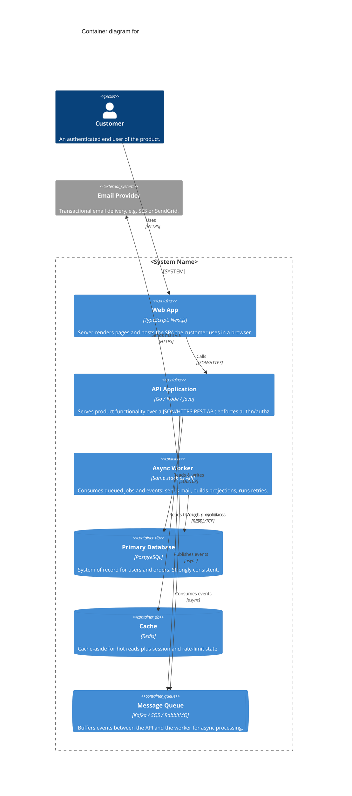

# C4 Level 2 — Container diagram

A Container diagram zooms into **one** software system — a single box from the System Context diagram (`c4-context.md`) — and shows the deployable/runnable units inside it and how they talk. It is the highest-value C4 level for most designs: it makes the tech choices and the process boundaries explicit without drowning in component detail. Draw the context diagram first, then this one; the two must reconcile — the same people and external systems appear at the edges of both.

Copy the Mermaid block below into your design doc or `docs/architecture/`, rename the boxes, and delete the containers you don't have. It renders as-is on GitHub and in the [Mermaid live editor](https://mermaid.live) — the diagram type is `C4Container`, so it lives in the repo as text and versions alongside the code.

## What "container" means here

A **container** is a separately deployable or runnable unit that executes code or stores data — something you could start, stop, scale, or deploy on its own. Examples: a server-side web app, a single-page app, a mobile or desktop app, a serverless function, a database, a cache, a blob store, a message broker. Communication *between* containers crosses a process boundary (usually a network call); communication *within* one is in-process and belongs to Level 3 (components), which you should reach for only when a container's internals are genuinely subtle.

Two things people get wrong:

- **It is not a Docker container.** A C4 container is a runtime/deploy boundary. It might map to one Docker container, several, or none — the concept predates and outlives the packaging.
- **Replicas collapse to one box.** A three-node API cluster behind a load balancer is *one* Container, not three. If you'd deploy and scale it as a unit, it's a unit.

Rule of thumb: if you could restart it independently and it has its own technology choice, it earns a box.

## The diagram

## Filling it in

- **`title` names the one system you're zooming into**, and it must match a box in your context diagram. One Container diagram per system — if you're tempted to draw two systems' internals at once, you want two diagrams.
- **Carry the people and external systems in from the context diagram** and place them outside the `System_Boundary`. If a person or external system appears here but not there (or vice versa), one of the diagrams is wrong.
- **Every container gets a technology in the third slot** (`"TypeScript, Next.js"`). The tech choice is the entire point of this level — a container with no technology is a context diagram in disguise.
- **Every relationship gets intent *and* protocol** (`"Calls", "JSON/HTTPS"`). Unlabeled arrows are the most common C4 smell; a reader should learn *what* flows and *how* from the edge alone.
- **Pick the right shape:** `ContainerDb` for data stores, `ContainerQueue` for brokers and queues, `Container` for everything that runs code. Add the `_Ext` suffix (`Container_Ext`, `ContainerDb_Ext`, `System_Ext`) for anything outside your team's deploy boundary — a managed database or a third-party API.
- **Delete what you don't have.** The cache, queue, and worker above are the common async trio, but a small synchronous system is legitimately just Web App → API → Database. Don't add a queue to the picture you don't run in production.

## Conventions and escape hatches

- **Layout:** if auto-layout crowds the boxes, tune `UpdateLayoutConfig` ($c4ShapeInRow, $c4BoundaryInRow), force an edge direction with `Rel_U/Rel_D/Rel_L/Rel_R`, or use `BiRel` for genuinely bidirectional links. Reach for these only when the default is unreadable.
- **Stop at container level.** Only drop to a Level 3 component diagram for a container whose internals are genuinely non-obvious — over-diagramming rots faster than it helps, because nobody updates the fifth diagram.
- **Pair the diagram with the reasons.** This diagram shows *what* the pieces are; it does not say *why*. For each load-bearing choice it depicts — the datastore, the sync-vs-async split, an added specialized store — write an ADR with `adr-template.md`. The diagram and the ADR log are complementary: one is the map, the other is the record of the turns you didn't take.
