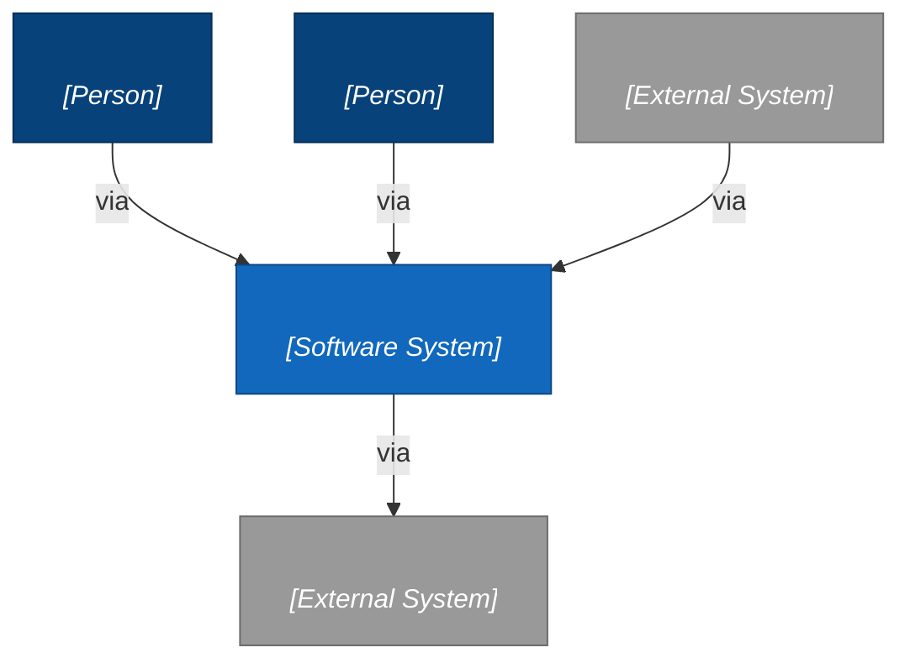
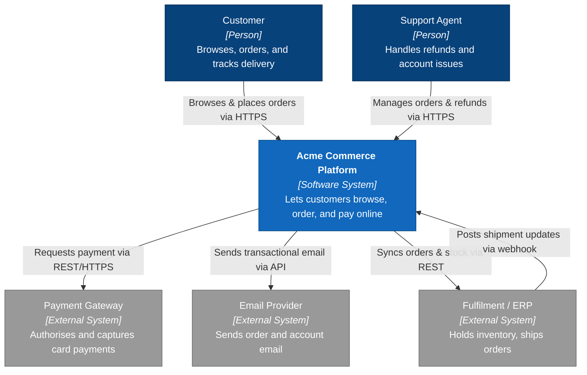

# C4 System Context (Level 1)

A System Context diagram answers one question for a mixed audience of engineers and non-engineers: **what is this system, who uses it, and what does it depend on?** It draws your system as a single black box, surrounds it with the people who use it and the external systems it talks to, and stops there. Nothing inside the box — no containers, no databases, no technology choices. Those live at Level 2 (Container) and below.

The load-bearing rule is **exactly one system in focus**. If you find yourself drawing two peer systems you own, you're either scoping too wide (draw a Context per system, or a System Landscape) or you've mistaken a container for a system. Every other box is a *black box*: a person who uses your system, or an external system you send to / receive from but do not build. Copy the blank template below into `docs/c4/context.md`, replace the placeholders, and delete the example at the bottom.

## What belongs at this level

- **The system in focus** — one box, named as the business names it, not the codebase.
- **People / actors** — every distinct human *role* that interacts with the system (customer, admin, support agent). Roles, not named individuals; not org charts.
- **External systems** — anything you depend on but don't own the internals of: payment gateways, email/SMS providers, identity providers, partner APIs, upstream systems of record.
- **Relationships** — one labelled arrow per interaction, in the direction data or intent flows. The label states the *intent* and, optionally, the *protocol* ("Places orders via HTTPS").

## What does NOT belong here (it leaks a lower level)

- Internal containers — web app, API, database, queue, cache. That's the Container diagram.
- Technology or framework names *inside* your box (React, Postgres, Kafka). Protocols on the arrows are fine; internals are not.
- Deployment topology, regions, replicas, networking — that's a deployment view, not Context.
- Every microservice you own drawn as a peer. From the outside, your system is one box.

## Blank template

Replace every `<...>` placeholder. Keep one `focus` node. Add or remove `person` and `external` nodes to match reality — a real Context diagram usually has 2–5 actors and 2–6 external systems; if it has twenty, you're at the wrong altitude.

## How to fill it in

1. **Name the system in focus** as the business calls it, and write a one-line responsibility in the box. If you can't say what it does in one line, the scope is wrong.
2. **List the actor roles**, not people. Merge two roles only if they truly do the same things through the system; split one role into two if the arrows would differ.
3. **List the externals** — walk every outbound call and every inbound webhook/callback. If your system can't function without it and you don't deploy it, it's an external system here.
4. **Draw and label every arrow.** Direction = who initiates or which way data flows. Label = intent first, protocol optional ("Requests payment via REST/HTTPS"). An unlabelled arrow is a TODO, not a diagram.
5. **Read it back as one sentence per arrow.** "The customer places orders via the platform; the platform requests payment via the gateway." If a sentence needs an internal detail to make sense, that detail belongs at Level 2 — cut it here.

Escape hatch: Mermaid also ships a native `C4Context` diagram type (`Person(...)`, `System(...)`, `System_Ext(...)`, `Rel(...)`). It encodes C4 semantics directly, but its auto-layout is less predictable than `graph`. Prefer the `graph` form above for control; reach for `C4Context` when you want the semantics enforced and don't mind the layout.

---

# Example (filled in)

A complete Context diagram for an e-commerce platform, so the shape is concrete. Delete this section from your real diagram.

When this diagram is stable, drop one level: the Container diagram (`templates/c4-container.md`) opens the focus box into its deployable units. Stop there unless a container is genuinely subtle — over-diagramming rots.
