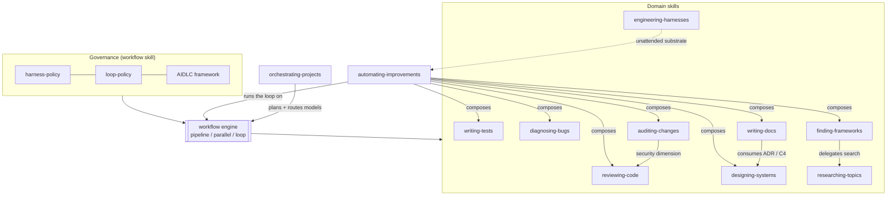
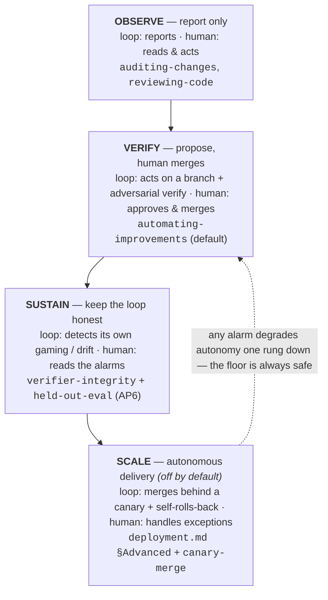

# TheLoopSkill

> **Run real engineering work as governed, multi-agent workflows** — a Claude Code plugin of 12 composable skills, from design and review to autonomous self-improvement.

[](LICENSE)
[](#whats-in-the-box)
[](#installation)
[](CONTRIBUTING.md)

TheLoopSkill turns a task into a **multi-agent Workflow** — pipeline by default, parallel fan-out where it's earned, loops for unknown-size discovery — governed by explicit engineering policies and a pluggable lifecycle framework. Eleven domain skills build on that engine to cover the whole build lifecycle, and one autonomous skill ties them into a self-improving loop.

## Contents

- [Why](#why)
- [What's in the box](#whats-in-the-box)
- [Quickstart](#quickstart)
- [How the skills compose](#how-the-skills-compose)
- [The `workflow` engine](#the-workflow-engine)
- [Architecture & philosophy](#architecture--philosophy)
- [Installation](#installation)
- [Repository layout](#repository-layout)
- [Contributing](#contributing)
- [License](#license)

## Why

A single agent handed a big task drifts: it skips verification, forgets what it already did, and hides how confident it is. TheLoopSkill answers that with **structure** — the same three moves the best engineers make, encoded as reusable skills:

- **Decompose and fan out** so breadth is covered in parallel, not serially.
- **Verify adversarially** — findings must survive a refutation attempt before they're reported.
- **Stay in the loop** — human gates between lifecycle phases; the loop proposes, a person approves.

It's for developers who want Claude Code to do *engineering*, not just answer questions — auditing a PR, designing a service, hunting a bug to root cause, or running an unattended improvement loop over a repo — with the rigor made explicit and the model choice matched to the job.

## What's in the box

| Skill | Invoke | What it does |
|---|---|---|
| **workflow** | `/workflow <task> [--framework <name>] [--dry-run]` | Authors and executes a multi-agent Workflow script — pipeline by default, earned parallel barriers, loops for unknown-size discovery — governed by the harness & loop policies and a lifecycle framework (default AIDLC). |
| **reviewing-code** | `/reviewing-code <target>` | Security + quality review using OWASP Top 10, CWE Top 25, ASVS, CVSS v4. Finder-per-category → dedup → adversarial verify; reports HIGH/MEDIUM at confidence ≥0.8. |
| **designing-systems** | `/designing-systems <problem>` | Architecture & system design: pattern selection, API design, backend/data modeling, frontend performance, deployment, NFRs. Emits ADRs + C4 diagrams. |
| **orchestrating-projects** | `/orchestrating-projects <project>` | Planning layer on `workflow`: decomposes a project into a task DAG and routes the right Claude model + effort to each task ("right model for the right job"). |
| **researching-topics** | `/researching-topics <question>` | Multi-source research with adversarial fact-checking: search fan-out → deep-read → refute-first verify → cited synthesis. Every claim carries a source. |
| **auditing-changes** | `/auditing-changes <diff\|PR\|range>` | Change/impact **report**: classifies changes, traces blast radius, rates risk, checks coverage; delegates the security dimension to `reviewing-code`. |
| **writing-tests** | `/writing-tests <target>` | Designs and writes tests (happy/edge/error/property), matches the repo's stack, and verifies each runs and fails for the right reason. |
| **diagnosing-bugs** | `/diagnosing-bugs <symptom>` | Hypothesis-driven debugging: reproduce → localize → root-cause → minimal fix → regression test, with parallel hypothesis elimination. |
| **writing-docs** | `/writing-docs <target>` | Writes/maintains docs (README, API, docstrings, ADRs) via the Diátaxis model, verifying every claim against the code. |
| **finding-frameworks** | `/finding-frameworks <need>` | Prior-art / build-vs-buy check *before* building: stdlib → registries → services → standards, evaluate, recommend reuse. Guards against over-engineering. |
| **engineering-harnesses** | `/engineering-harnesses <goal>` | Sets up a project's Claude Code harness from copy-paste scaffolds: permissions, hooks, MCP (`.mcp.json`), and automation loops. |
| **automating-improvements** | `/automating-improvements <repo>` | Autonomous engineering loop — reads feedback (issues/PRs/CI), acts as **draft** PRs with tests, researches improvements when idle. Propose-only, never merges. |

## Quickstart

```
# 1. Add the marketplace and install the plugin
/plugin marketplace add santapong/TheLoopSkill
/plugin install theloopskill@theloopskill

# 2. Run your first workflow (dry-run shows the script without executing)
/workflow audit this repo's docs for quality issues --dry-run

# 3. Or reach for a domain skill directly
/reviewing-code the changes on this branch
/finding-frameworks I need to add rate limiting to an Express API
```

No install needed to try it inside this repo — the skills live in `.claude/skills/` and are auto-discovered by any Claude Code session opened here. See [Installation](#installation) for local, web, and plugin paths.

## How the skills compose

The skills aren't a flat list — they build on `workflow` and delegate to each other rather than duplicating logic:



At the base is the `workflow` engine and the two policies that govern it. `orchestrating-projects` and `automating-improvements` sit on top as planning/automation layers. Domain skills delegate where it's natural — `auditing-changes` calls `reviewing-code` for security, `writing-docs` consumes the ADR/C4 that `designing-systems` emits, `finding-frameworks` hands its search to `researching-topics`.

## The autonomy ladder

The plugin isn't only twelve skills — it's a **progression of autonomy**. Four rungs, each removing one unit of human involvement from the engineering loop. The rule is the whole discipline: **you climb only when the rung below is solid.** The human never disappears; they move from *doing the work*, to *approving it*, to *reading the alarms*, to *handling the exceptions*.



| Rung | The loop does | The human does | Implemented by | Status |
|---|---|---|---|---|
| **OBSERVE** | Reports findings; takes no action | Reads the report, decides | `auditing-changes`, `reviewing-code` | ✅ shipped |
| **VERIFY** | Acts on a `claude/` branch, verifies adversarially, opens a draft PR | Approves and merges | `automating-improvements` (default mode) | ✅ shipped |
| **SUSTAIN** | Detects when its own verifier is gamed or the loop meta-overfits | Reads the alarms; freezes config on a trip | `references/verifier-integrity.md` + `references/held-out-eval.md` | ✅ shipped |
| **SCALE** | Merges behind a canary and rolls itself back on a bad signal | Handles the exceptions a rollback raises | `references/deployment.md` §Advanced + `templates/canary-merge.workflow.js` | 🔒 off by default |

**Why SCALE is off by default — and why the ladder is sound anyway.** No production system removes the human from the merge step for *general* code (the ones that auto-ship do it only for narrow classes where CI is a complete spec). So SCALE ships as a **gated, reversible design draft**, not a proven recipe: it is enabled per-kind, only while every SUSTAIN signal is green, and it revokes its own autonomy the moment an alarm fires. That is the property that makes the whole ladder safe to climb — **it degrades downward.** SUSTAIN alarms freeze the loop; a SCALE trip drops it back to VERIFY; and VERIFY's floor — propose-only, a human merges — is always there to catch it. The worst case is never a runaway loop. It's a loop that quietly goes back to asking permission.

## The `workflow` engine

```
/workflow <task> [--framework <name>] [--dry-run]
```

Examples:

```
/workflow audit this codebase for security issues
/workflow build the CSV export feature --framework AIDLC
/workflow find all flaky tests --dry-run
```

- `--framework <name>` — the lifecycle framework governing the phases (default `AIDLC`; resolves to `.claude/skills/workflow/frameworks/<name>.md`)
- `--dry-run` — author and show the workflow script without executing it

When invoked, the skill reads the two engineering policies and the chosen framework → maps the task onto the framework's phases → picks the orchestration shape (pipeline by default; barriers and loops only where the policies allow) → authors a script from the JS templates → runs it via the Workflow tool → reports results, pausing at the framework's human gates.

### What a run looks like

For `/workflow audit the docs for quality issues`, the skill authors a script from `templates/pipeline.workflow.js` — an Analyze stage fanning out one agent per file, feeding a Verify stage that adversarially checks each finding — and executes it. A real run of that shape produced:

```
Analyze  ✔ analyze:README.md            ✔ analyze:frameworks/AIDLC.md
Verify   ✔ verify:… ×4  (3 findings refuted, 1 confirmed)
→ { confirmed: [{ title: "No example of output…", location: "README.md:24", ... }] }
```

Confirmed findings come back as structured data, with everything the verifiers refuted filtered out. With `--dry-run` you get the authored script itself; when a framework phase ends at a human gate, the run stops and presents that phase's deliverable for approval.

## Architecture & philosophy

Every authored workflow obeys two policy documents:

- **[Harness Engineering Policy](.claude/skills/workflow/references/harness-policy.md)** — orchestration design: pipeline vs. earned parallel barriers, adversarial/diverse-lens verification, budget & concurrency, isolation, phase discipline.
- **[Loop Engineering Policy](.claude/skills/workflow/references/loop-policy.md)** — iteration: loop-until-dry, budget-guarded loops, seen-set convergence, runaway prevention.

Lifecycle is governed by a **pluggable framework** — the default **AIDLC** (Inception → Construction → Operation, each ending at a human gate). Drop a new `frameworks/<Name>.md` in and invoke with `--framework <Name>`.

**Standards-grade knowledge.** Every skill carries a `references/standards.md` that names, version-pins, and maps the authoritative standards it applies — e.g. OWASP / CWE / CVSS v4 / NIST SSDF / SLSA for review, C4 / ISO-25010 / Google SRE for design, CRAAP / SIFT / PRISMA / GRADE for research, ISO 31000 for change audit, 5 Whys / ODC / OpenTelemetry for debugging. Skills reason from cited, edition-pinned standards, not vibes.

## Installation

Three ways to use these skills — see **[INSTALL.md](INSTALL.md)** for full detail.

- **Local (project skills)** — the skills live in `.claude/skills/` and are auto-discovered in any Claude Code session opened in this repo. Copy an individual skill directory into another project's `.claude/skills/` to reuse it.
- **Remote (Claude Code on the web)** — web sessions see only committed project files; everything here is committed. Open the repo on [code.claude.com](https://code.claude.com) and the skills are available. `.claude/settings.json` enables the plugin for web sessions.
- **Plugin (marketplace)** — `/plugin marketplace add santapong/TheLoopSkill` then `/plugin install theloopskill@theloopskill`.

## Repository layout

Every skill follows the same shape: `SKILL.md` (thin router) + `references/` (deep knowledge, incl. a `standards.md`) + `templates/` (runnable workflow scripts or scaffolds).

| Path | What it is |
|---|---|
| `.claude/skills/workflow/` | The engine: `SKILL.md`, `references/` (harness & loop policies, standards), `templates/` (pipeline, parallel, loop-until-dry, loop-until-budget), `frameworks/` (AIDLC + scaffold) |
| `.claude/skills/reviewing-code/` | Security + quality review: methodology, OWASP/CWE, playbooks, severity model, standards, `security-review.workflow.js` |
| `.claude/skills/designing-systems/` | Architecture: patterns, API, backend, frontend, deployment, NFR, standards; ADR + C4 templates |
| `.claude/skills/orchestrating-projects/` | Model routing + task decomposition + standards; `project-plan.workflow.js` |
| `.claude/skills/researching-topics/` | Methodology, source evaluation, standards; `research.workflow.js` |
| `.claude/skills/auditing-changes/` | Methodology, report template, standards; `change-audit.workflow.js` |
| `.claude/skills/writing-tests/` | Test design, framework conventions, standards; `test-generation.workflow.js` |
| `.claude/skills/diagnosing-bugs/` | Methodology, hypothesis testing, standards; `bug-diagnosis.workflow.js` |
| `.claude/skills/writing-docs/` | Doc types, style, standards; `doc-generation.workflow.js` |
| `.claude/skills/finding-frameworks/` | Where to look, evaluation criteria, build-vs-buy, standards; `prior-art-search.workflow.js` |
| `.claude/skills/engineering-harnesses/` | Permissions, hooks, mcp, automation-loops, standards; settings/mcp/hook scaffolds |
| `.claude/skills/automating-improvements/` | Loop-design, feedback-intake, deployment (incl. SCALE), anti-patterns, comprehension-rot, credit-horizon, verifier-integrity + held-out-eval (the SUSTAIN rung), standards; loop + ledger + routine + held-out-eval + verifier-canary + canary-merge templates |
| `.claude-plugin/plugin.json`, `marketplace.json` | Plugin + marketplace manifests |
| `.claude/settings.json` | Enables the plugin for Claude Code on the web |
| `INSTALL.md`, `CONTRIBUTING.md`, `CHANGELOG.md` | Install paths, contributor guide, version history |

## Contributing

Contributions welcome — new skills, deeper reference standards, more frameworks. See **[CONTRIBUTING.md](CONTRIBUTING.md)** for the `SKILL.md` conventions, the workflow-template rules (including the runtime constraints), and how to validate a change (`claude plugin validate --strict`, `node --check`).

## License

[MIT](LICENSE) © santapong
